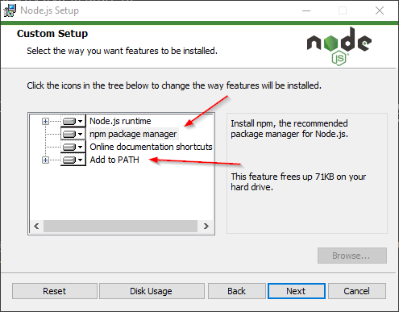
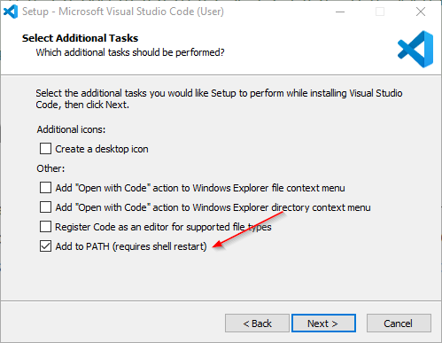

# Jak uruchomić tą Katę na Windows

Witam, poniższy tekst opisuje wszystkie **niezbędne** kroki w celu instalacji, uruchomienia i wzięcia udziału w
naszym wyzwaniu programistycznym.

**Uwaga!** Jeżeli jestem zaawansowanym programistą, może spokojnie _olać_ ten dokument, ale mniej doświadczonych
zachęcamy do co najmniej przejrzenia tego samouczka.

## Niezbędne oprogramowanie

Będziesz potrzebował/ła kilku narzędzi, są to: Git, Node.js i Visual Studio Code (VS Code).

Moje wersje tych narzędzi (na których wszystko działa) to:
- Git 2.27.0,
- Node.js 12.16.2,
- VS Code 1.46.1.

### Instalacja Git-a

Pobierz plik instalacyjny z strony [https://git-scm.com/download/win](https://git-scm.com/download/win). Uruchamiamy instalator
i klikamy kolejne przyciski _dalej_ pozostawiając domyślne opcje (nie będziemy w nie wnikać za _pierwszym razem_).
Na koniec zweryfikuj czy Git został poprawnie zainstalowany uruchamiając w konsoli polecenie:
```
git --version
```
Przykładowo:
```
> git version
git version 2.27.0.windows.1
```

### Instalacja Node-a + npm

Pobieramy instalator z strony [https://nodejs.org/en/](https://nodejs.org/en/), podobnie jak wyżej uruchamiamy instalator
i klikamy kolejne przyciski _dalej_. Uważaj, żeby mieć oznaczone opcje odpowiadające za npm_i dodanie node-a do
zmiennych środowiskowych! Zobacz poniższy zrzut ekranu.



Na koniec zweryfikuj czy Node i npm zostały poprawnie zainstalowane uruchamiając w konsoli polecenia:
```
node --version
npm --version
```
Przykładowo:
```
> node --version
v12.16.2
> npm --version
6.14.4
```

### Instalacja Visual Studio Code

Pobierz plik instalacyjny z strony [https://code.visualstudio.com/Download](https://code.visualstudio.com/Download). Uruchamiamy instalator
i klikamy kolejne przyciski _dalej_. **Zachęcamy** do dodania VS Code do zmiennej środowiskowej _PATH_, robimy to przez zaznaczenie opcji
podczas instalacji, rzuć okiem na poniższy zrzut ekranu.



Na koniec zweryfikuj tradycyjna weryfikacja przez uruchomienie w konsoli polecenia:
```
code --version
```
Przykładowo:
```
> code --version
1.46.1
cd9ea6488829f560dc949a8b2fb789f3cdc05f5d
x64
```

## Pobranie i uruchomienie Kata

Poniższa sekcja zawiera sposób uruchomienia i instalacji programistycznej Katy.

### Pobranie plików

Otwórz konsolę i przejdź do folderu w którym chcesz zapisać pliki związane z zadaniem, na koniec uruchom polecenie:
```
npm init @coding-dojo-silesia/gameoflife-kata
```
Powyższa komenda powinna pobrać i zainstalować wszystkie niezbędne biblioteki i pliki. Całość zostanie zapisana w podfolderze
o nazwie _gameoflife-kata_. Nazwę folderu zmienić stosując lekko zmodyfikowane polecenie:
```
npm init @coding-dojo-silesia/gameoflife-kata moj_folder_kata
```
Kod Katy zostanie umieszczony wówczas w folderze _moj_folder_kata_.

Przechodzimy do utworzonego folderu i rozpoczynamy zadanie przez wykonanie polecenia otwierającego IDE:
```
code .
```
Komenda uruchomi VS Code z otwartym folderem zawierającym pliki zadania.

### Praca nad zadaniem

Podczas instalacji za pomocą powyższych komend program podpowie dwie komendy: `npm test` i `npm run readme`. Zacznij od tej drugiej,
wróć do konsoli i wpisz ją w terminal.
```
>npm run readme

> @ readme ...\gameoflife-kata
> node kata/reader.js readme

.-=-=-=-=-=-=-=-=-=-=-=-=-=-=-=-=-=-=-=-=-=-=-=-=-=-.
| Game of Life Kata                                 |
`-=-=-=-=-=-=-=-=-=-=-=-=-=-=-=-=-=-=-=-=-=-=-=-=-=-`

[About]

The Kata is about writing a function that calculates
the next generation of Conway’s Game of Life.
...
```

Komenda wyświetli opis zadania, które należy wykonać w tym również opis plików przygotowanego przez nas _boilerplate_-u (czyli plików, które pozwolą od razu wziąć się do pracy!). Odpal więc czym prędzej edytor i zacznij pisanie programu i testów (jeden prościutki test przygotowaliśmy za CIEBIE!).

Powodzenia!
Ekipa Coding DOjo Silesia
